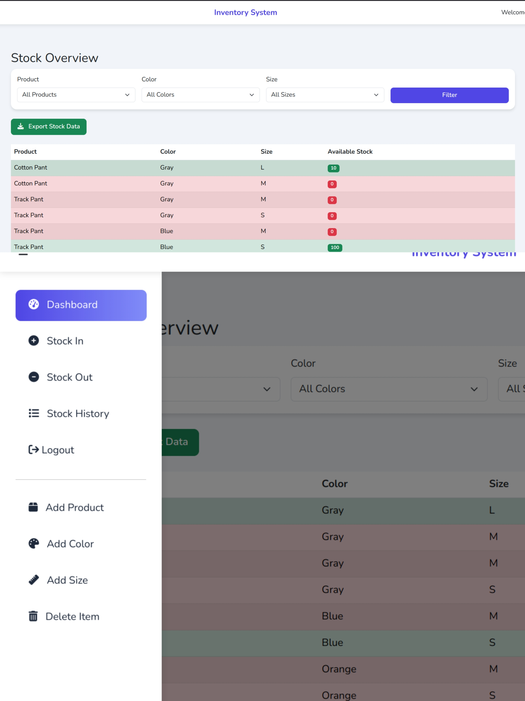

## Inventory Management System

This is a web-based Inventory Management System built with **Django** and **Bootstrap**. It allows users to manage products, stock in/out, and view inventory dashboards with a modern, responsive UI.

---

## Features

- User authentication (login/logout)
- Add, update, and delete products
- Stock in and stock out management
- Dashboard with inventory overview
- Search and filter stock items
- Custom error pages (404, 500)
- Responsive design using Bootstrap

---

## Screenshots



---

## Try demo :

Link : https://inventory-management-idvb.onrender.com/

Username : testuser

Password : test@123

---


## Getting Started

### Prerequisites

- Python 3.8+
- pip
- Django (see requirements)

### Installation

1. **Clone the repository:**

   ```fish
   git clone https://github.com/SaiDhinakar/Inventory-Management.git
   cd Inventory-Management
   ```
2. **Install dependencies:**

   ```fish
   pip install -r requirements.txt
   # or if using uv:
   uv sync
   ```
3. **Apply migrations:**

   ```fish
   cd StockManagement
   python manage.py migrate
   ```
4. **Create a superuser (admin):**

   ```fish
   python manage.py createsuperuser
   ```
5. **Run the development server:**

   ```fish
   python manage.py runserver
   ```
6. **Access the app:**
   Open your browser and go to [http://127.0.0.1:8000/](http://127.0.0.1:8000/)

---

## Project Structure

```
Inventory-Management/
├── main.py
├── pyproject.toml
├── README.md
├── uv.lock
├── Screenshots/
│   └── screenshot.jpg
└── StockManagement/
    ├── db.sqlite3
    ├── manage.py
    └── Inventory/
        ├── static/
        │   └── css/
        │       └── custom.css
        ├── templates/
        │   ├── base.html
        │   ├── dashboard.html
        │   └── ...
        ├── models.py
        ├── views.py
        └── ...
```

---

## Technologies Used

- Django
- Bootstrap 4/5
- SQLite (default, can be changed)

---

## Customization

- To change styles, edit `Inventory/static/css/custom.css`.
- To update templates, edit files in `Inventory/templates/`.

---

## Credits

- [Django](https://www.djangoproject.com/)
- [Bootstrap](https://getbootstrap.com/)
